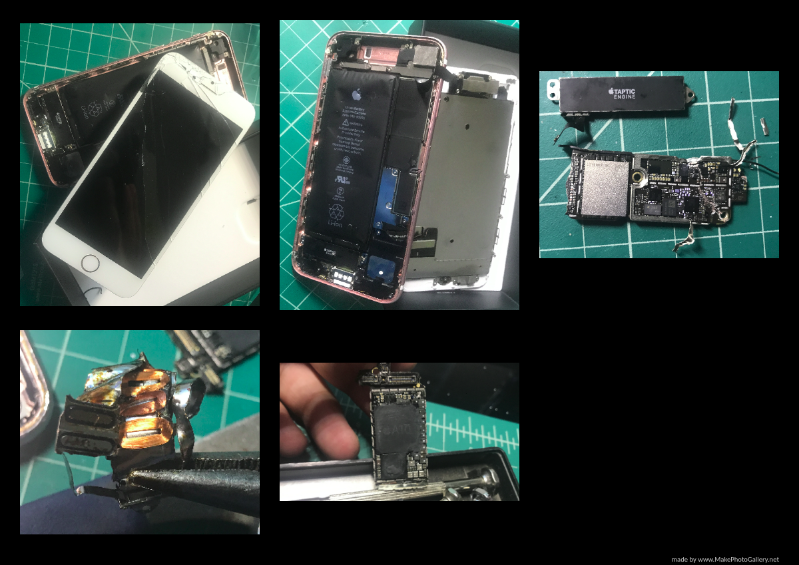

# Reversed-Engineered-iPhone-7

<h2>Tools</h2>
<ul>
  <li>Tweezers</li>
  <li>Wrench</li>
  <li>Screw Driver Set for Small Screws</li>
  <li>Clean Surface</li>
  <li>Plastic Bag for Disposing of Components</li>
</ul>  

<h2>Motivation for the Project</h2>

Another iPhone to experiment on!!! I got this iPhone 7 after it was dropped and the screen completely shattered. This time I decided to look more in depth in the iPhone and break open the circuit with a wrench. After bending the metal completely to expose the circuit I finally got to see the capacitors, resistors, and ICs that get the camera working, the screen, and the phone overall. Yet, what really shattered my mind was the Apple Taptic Engine not because it was a pain to open as seen in the last picture in the gallery above with the magnets and coils, but it shows me the application of electromagnetism.

From what I observed, it seems that the reason why when you tap your iPhone such as opening the Calendar app the magnets in the engine move to induce a current between the copper coils. The current then travels to the circuit board to get processed by the ICs and produce the expected output, which was in this example opening the Calendar app. I did research the A10 Fusion, which is the IC (integrate) that makes the iPhone a computer and it is often referred as a system on a chip (<a href="https://www.notebookcheck.net/A12-Bionic-vs-A10-Fusion_10166_8178.247596.0.html">NotebookCheck</a>). I still have more to learn about the Apple Hardware, and it will take time, but I am finding myself enjoying the process of learning the computer architecture.
